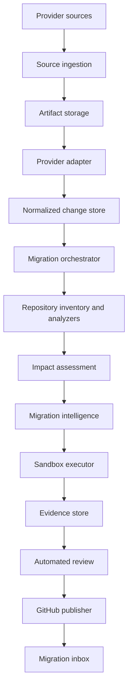

# RFC: Delta Code API migration platform

- **Status:** Accepted product direction; implementation contracts proposed
- **Date:** 2026-07-31
- **Owners:** Delta Code maintainers
- **Supersedes:** The pull-request API regression verifier as the primary
  product definition

## Summary

Delta Code is Dependabot for APIs. It monitors authoritative external API and
SDK changes, determines which connected repositories and call sites are
affected, generates repository-specific migrations and tests, verifies those
changes in a sandbox, opens evidence-rich draft pull requests, reviews its own
work, and recommends that a developer approve, revise, snooze, or decline the
migration.

The platform is provider-independent. Provider-specific integrations end at a
normalized change contract; repository analysis, migration generation,
verification, GitHub publishing, and the dashboard operate on common models.

## Problem

External API changes are announced separately from the code that consumes
them. Changelogs are easy to miss, SDK releases do not always communicate API
behavior clearly, and a provider cannot know which customer repositories and
call sites are affected. Developers must manually connect source material to
dependencies, usages, code changes, tests, and deployment risk.

Package update tools can propose a version bump, while general coding agents
can modify a repository when instructed. Neither supplies the causal chain
Delta Code is responsible for:

> An authoritative external change occurred; this repository is affected at
> these call sites; this patch performs the migration; and this verification
> evidence shows what passed, failed, or remains uncertain.

## Target users

- Application teams that depend on third-party APIs and SDKs.
- Platform teams responsible for dependency and migration policy across many
  repositories.
- API providers that want their changes to be safely adoptable by customers.
- Reviewers who need evidence before accepting generated changes.

## Product principles

1. **Authoritative provenance.** Every change and material claim links back to
   an official source and a captured artifact hash.
2. **Provider-independent core.** Adapters translate provider artifacts into a
   shared model; they do not own migration orchestration.
3. **Repository-specific work.** A provider change is not actionable until it
   is connected to concrete dependencies and call sites.
4. **Evidence before confidence.** Compilation, tests, and observed behavior
   outrank model assertions.
5. **Human-controlled outcomes.** Delta Code may prepare draft pull requests;
   it does not merge them in the initial product.
6. **Explicit uncertainty.** Unsupported analysis, missing tests, ambiguous
   documentation, and incomplete verification are visible states.
7. **Auditable attempts.** Regeneration creates a new immutable attempt rather
   than overwriting prior patches or evidence.
8. **Least privilege.** Repository tokens, provider credentials, and customer
   secrets never enter the model prompt or untrusted sandbox by default.

## End-to-end workflow

```mermaid
flowchart LR
    S["Official source changes"] --> I["Ingest and fingerprint"]
    I --> N["Normalize change"]
    N --> F["Fan out to repositories"]
    F --> A["Analyze dependencies and call sites"]
    A --> P["Plan repository migration"]
    P --> G["Generate code and tests"]
    G --> V["Verify in sandbox"]
    V --> R["Review patch and evidence"]
    R --> D["Open draft pull request"]
    D --> H["Human decision"]
```

The same change event can produce an unaffected assessment, an uncertain
assessment, or one migration per affected repository.

## User experience

The authenticated product leads with a migration inbox rather than a list of
verification runs. Each inbox row answers:

- What provider changed?
- Which repository is affected and why?
- What is the risk and effective date?
- Has a draft pull request been opened?
- Which verification checks passed or failed?
- How confident is the recommendation?
- What action is required?

The primary screens are:

1. **Migration inbox:** vendor, change, affected repository, risk, confidence,
   deadline, PR state, verification state, and review action.
2. **Change detail:** official sources, normalized before/after semantics,
   affected and unaffected repositories, and analysis coverage.
3. **Repository migration:** call sites, plan, changed files, tests, attempts,
   evidence, uncertainty, and recommendation.
4. **Verification evidence:** command-level and behavioral results with logs
   and artifact references.
5. **Providers:** configured sources, health, synchronization, and change
   history.
6. **Repositories:** access, indexed dependencies, languages, providers, and
   analysis capabilities.
7. **Policies:** draft-PR behavior, allowed repositories, sandbox policy,
   notification rules, and snooze defaults.

## Pull-request contract

Every generated draft pull request must explain:

- Which provider changed and why the repository is affected.
- Links to authoritative documentation.
- Affected files, symbols, and call sites.
- What Delta Code changed and intentionally did not change.
- Tests added or modified.
- Build, formatting, lint, type-check, test, and behavioral results.
- Confidence level and unresolved uncertainty.
- A clear approve, revise, snooze, or decline recommendation.

The pull-request body is rendered from stored structured evidence. An LLM may
improve the explanation but may not invent check results or source links.

## System architecture

PostgreSQL remains the system of record for metadata and state transitions.
Large source artifacts, patches, and execution logs should move to immutable
object storage rather than growing unbounded JSONB records. The existing
PostgreSQL-backed worker can orchestrate the first vertical slice, provided
jobs are idempotent and attempts are immutable.

## Platform foundation

The product uses GitHub App repository access, OAuth identity, repository-scoped
authorization, PostgreSQL persistence, durable background jobs, and isolated
sandbox execution. Repository fetching is mediated by the repository workspace
contract, and GitHub publishing always uses the exact verified migration artifact.

## Deterministic and model responsibilities

Deterministic systems own source retrieval, hashes, OpenAPI and SDK diffing,
package discovery, lockfile parsing, symbol analysis where supported, Git
operations, compilation, commands, tests, and observed behavioral evidence.

Models may interpret prose, map documentation into structured change
candidates, understand repository context, propose impact reasoning, plan
migrations, generate code and tests, explain evidence, and review a completed
patch. Every model output is schema-validated, labeled as inferred, and
discardable without corrupting deterministic evidence.

## Generalization strategy

The core is generalized before any production provider is selected. Phase 1
uses fixture-backed adapters for at least two structurally different source
types—for example, an OpenAPI revision and a prose/SDK release—to prove the
contract does not assume one vendor.

Production rollout can activate providers incrementally. This is an operational
sequence, not an architectural restriction. A provider is ready only when its
source coverage, normalization quality, and migration limitations are explicit.

Language support follows the same pattern: analyzers implement a common
contract and publish a capability manifest. Unsupported languages produce an
`uncertain` or `unsupported` assessment rather than a guessed migration.

## Initial delivery boundaries

Included in the first vertical slice:

- Official-source ingestion and deduplication.
- Two source-format adapters through one normalized schema.
- Connected GitHub repository inventory.
- Deterministic dependency discovery.
- At least one AST-capable language analyzer plus a second fixture-backed
  language implementation or explicit unsupported result.
- Repository-specific plan, patch, and test generation.
- Sandboxed verification with structured checks.
- Evidence-rich draft pull request.
- Migration inbox and audited review actions.

Excluded initially:

- Generic style or maintainability review unrelated to the provider change.
- Automatic merging or production deployment.
- Silent changes to CI workflows, infrastructure, secrets, or access policy.
- Claims based only on unofficial sources.
- Arbitrary execution on the existing trusted worker.
- Pretending unsupported frameworks or languages were fully analyzed.

## Success measures

The private beta should measure:

- Change-detection latency from official publication.
- Normalization acceptance rate and source coverage.
- Impact-analysis precision and recall on a labeled benchmark.
- Percentage of affected call sites supported by deterministic evidence.
- Migration verification pass rate.
- Draft PR acceptance, revision, snooze, and decline rates.
- Median time from source detection to verified draft PR.
- Human time from inbox review to decision.
- False-authoritative-claim count, with a target of zero.
- Sandbox escapes, secret exposure, and unauthorized writes, with a target of
  zero.

## Delivery phases

1. **Phase 0 — contracts:** this RFC, domain model, system interfaces, schemas,
   and security decisions.
2. **Phase 1 — control plane:** persistence, APIs, state transitions,
   idempotent orchestration, fixtures, and audit events.
3. **Phase 2 — ingestion:** source collectors, artifact storage, normalization,
   provenance, and provider/source health.
4. **Phase 3 — repository intelligence:** snapshots, dependencies, symbols,
   call sites, and impact assessments.
5. **Phase 4 — generation and sandbox:** model adapters, plans, patches, tests,
   isolated execution, and evidence.
6. **Phase 5 — GitHub publishing:** branches, commits, draft PRs, checks, and
   revision synchronization.
7. **Phase 6 — migration inbox:** new dashboard information architecture and
   developer actions.
8. **Phase 7 — generalization and hardening:** additional adapters, languages,
   benchmarks, observability, cost controls, and security review.

## Phase 0 decisions

- The product domain is change events, impacts, and migrations—not generic
  review runs.
- Provider-specific parsing stops at the normalized change schema.
- One provider change creates independent repository impact assessments and
  migrations.
- Attempts and evidence are immutable.
- Approve does not merge; it marks a draft ready for normal human review.
- Deterministic and inferred claims remain separately identifiable.
- Repository code runs only inside the sandbox boundary.
- GitHub write permissions are deferred until the publishing phase.
- A real LLM key is deferred until deterministic context, schemas, mocks, and
  sandbox controls exist.

## Decisions required before implementation milestones

These choices are intentionally deferred and must be recorded as architecture
decisions before their dependent phase starts:

- First production provider sources and their update guarantees.
- Initial production languages and package ecosystems.
- Object storage service and artifact-retention period.
- Hosted sandbox technology and network policy implementation.
- Whether draft PRs open automatically or require workspace policy approval.
- Model providers, data-retention settings, budgets, and fallback behavior.
- Notification channels and organization/workspace membership model.

## Phase 0 acceptance

Phase 0 is accepted when the accompanying domain, system, security, and JSON
Schema documents can describe the first vertical slice without provider- or
language-specific branches in the core orchestrator.
